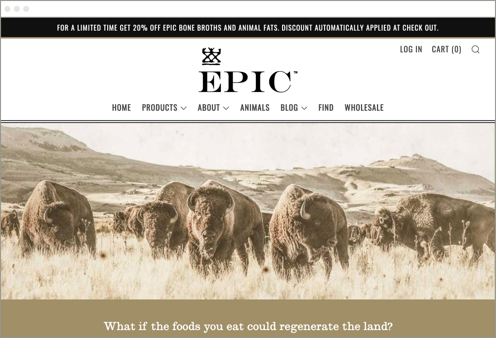
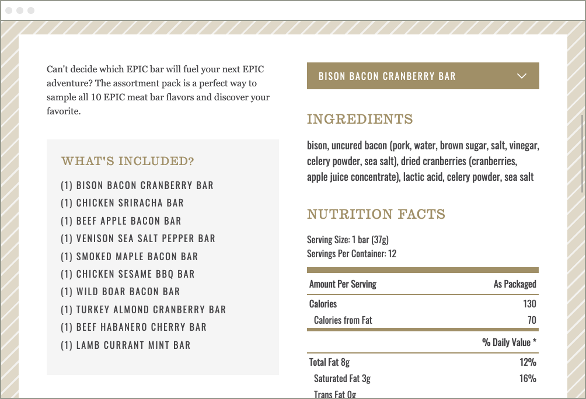
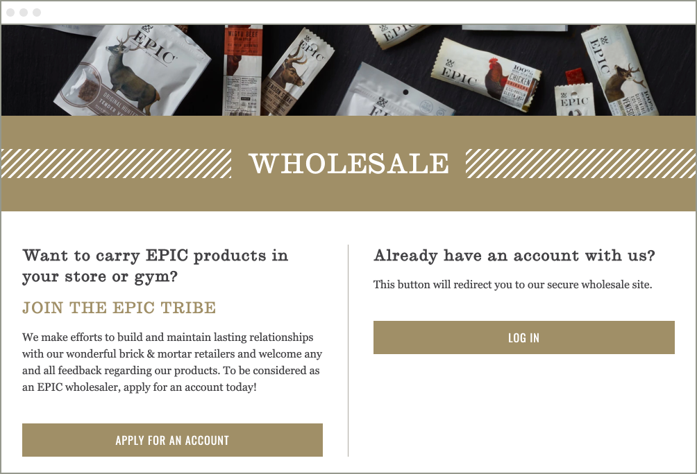

EPIC Provisions came to our team looking originally to just add a new product line to their current website. After some investigation, we quickly found out there were actually two websites that powered the EPIC experience online. There was one homegrown CMS site handling the majority of the site content, and then a Shopify site for the store functionality. After taking inventory of their content, we determined it would best to house all of their content and shopping experience within the confines of Shopify. We started down the journey of a custom theme built on top of the Slate framework and leveraging Accentuate Custom Fields to improve the authoring experience.

While building out a new theme for EPIC, we quickly realized that we had a new challenge. The old website was handling not just regular sales to consumers, but also the wholesale portion of their business. After some quick research, we actually determined the recently released wholesale channel offered by Shopify would fit their needs well. This turned out to be a great solution because it offered functionality that would be tough to recreate using the normal Shopify direct to consumer model.

Overall, we were extremely happy with our decision to leverage Shopify for a complete website overhaul. The EPIC team was thrilled with the results and how quickly they could now activate new products and campaigns.

