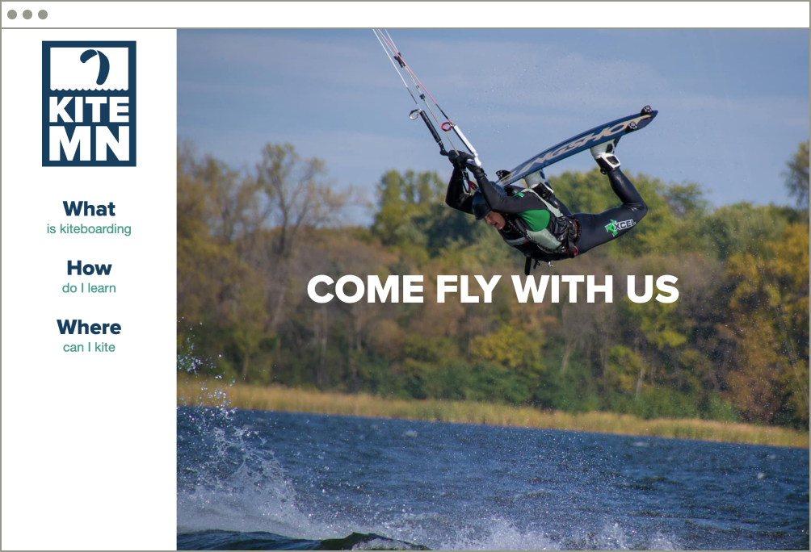
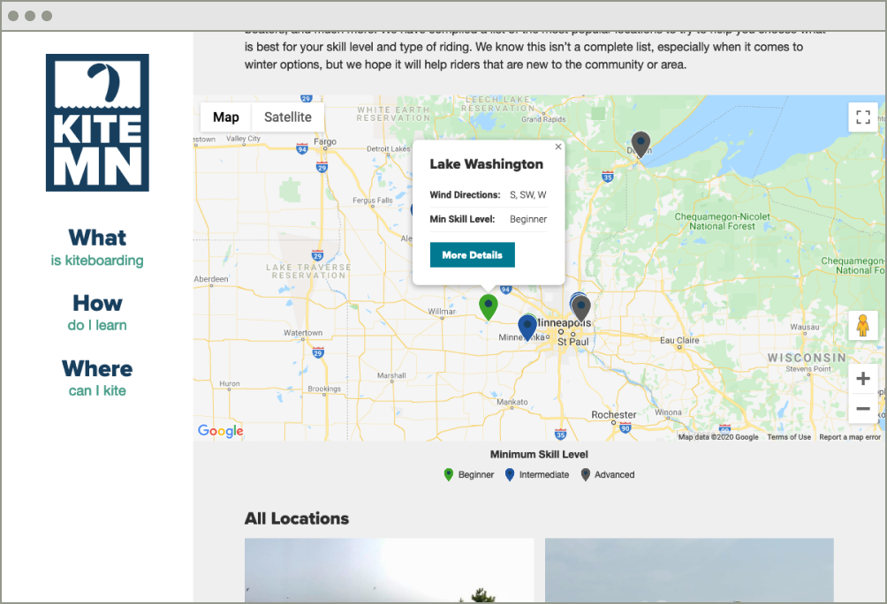
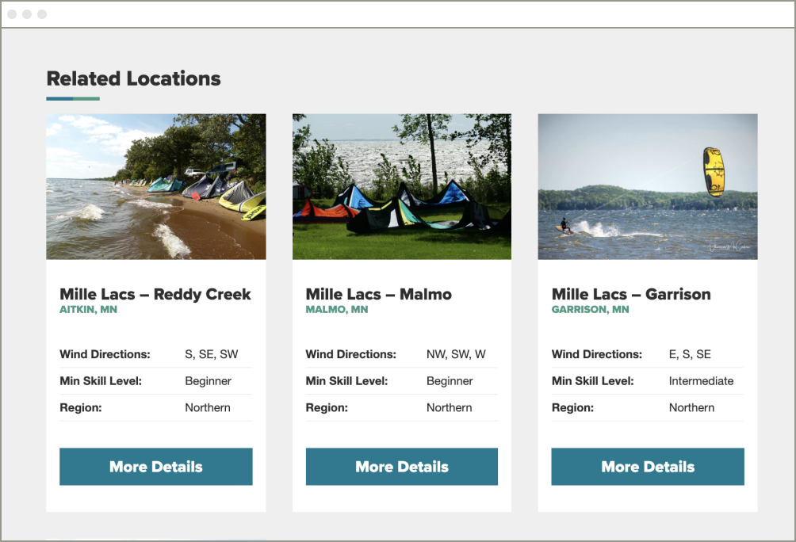
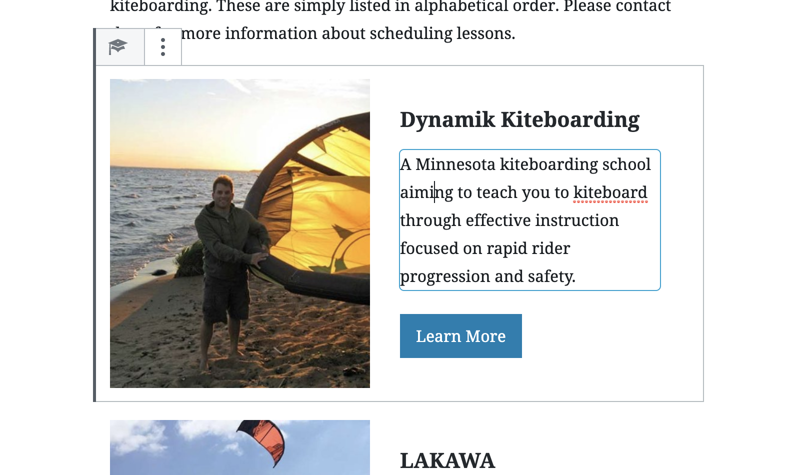

One of my main hobbies in life is kiteboarding. It gives me a thrill like no other sport and is the closest thing I have ever experienced to flying. Here in Minnesota, we have a wonderful community of kiteboarders that care for the places we frequent and support each other while participating in a dangerous sport. The being said, we didn't have anything on the web that could support our community and share what we learned with outsiders or visitors. To solve this problem, I set out to build something for the community I love. That something would be called Kiteboard Minnesota.

Whenever I take on a side project, I try and do it in a way that will expand my skills. Sometimes this means trying a new web technology, and sometimes this means performing completely new job responsibilities. For Kiteboard Minnesota, I decided to stretch myself and do both. I wanted to complete a web project from start to finish all by myself which would include branding, design, copywriting, development, and finally SEO. Beyond all that, I choose to take this opportunity to learn how to use the new Gutenberg editor in WordPress.

Even though I bit off quite a bit, in the end I was very happy the way it turned out. Throughout the process I gained a large amount of empathy for the talented people I get to work with in this industry. Finally, I couldn't be happier to contribute something to the kiteboard community I love. 

