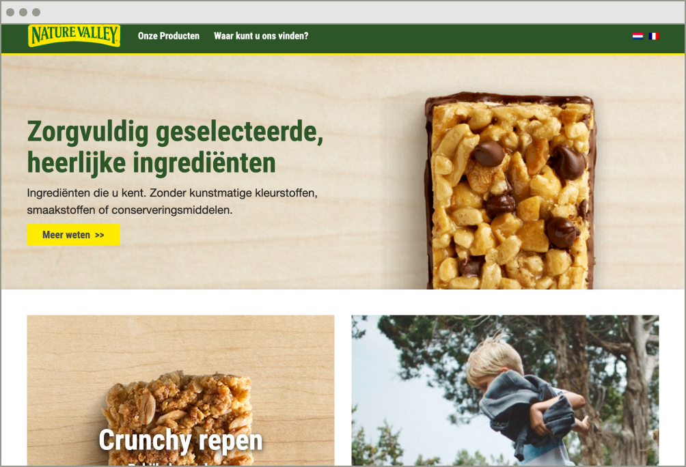
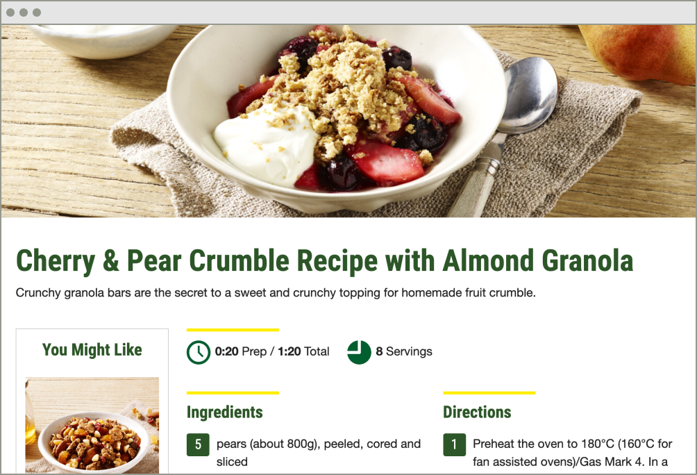
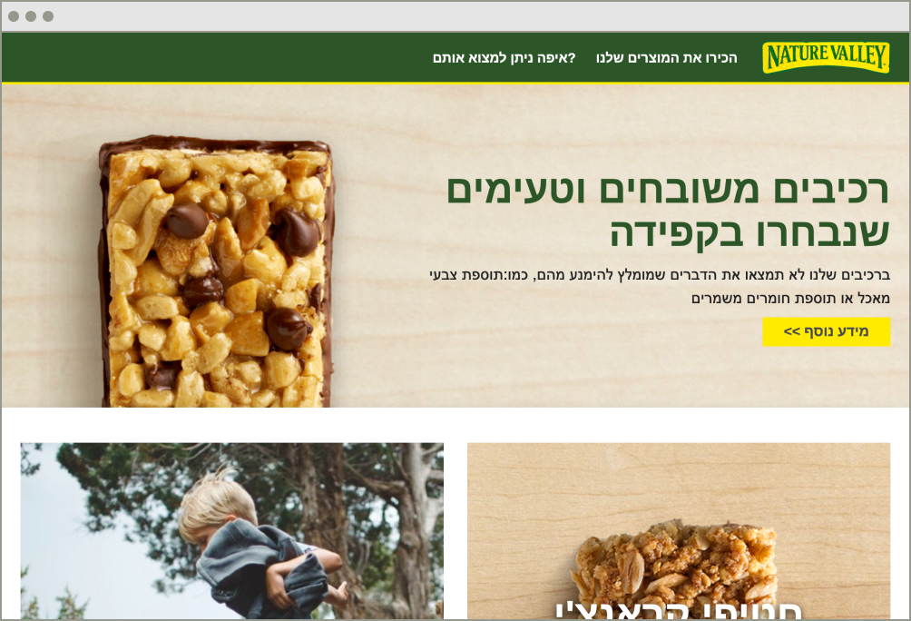

When I was initially asked to build out twenty-two different sites for Nature Valley in Europe, I thought to myself, "There has to be a better way." Building out that many different sites in WordPress would create a maintenance nightmare for everybody involved. Not only would you need to keep you custom theme up-to-date, you would also be constantly updating any plugins you chose to use. After some research, I was happy to find a solution.

The solution I chose to use is WordPress Multisite. I always knew that Multisite existed, but I never quite understood when I would use it. All that changed though when I started to see if it would fit my requirements for the Nature Valley Europe build. The following features made the decision easy to go with Multisite:

* Custom themes are shared between all sites
* Plugins can be installed network-wide
* Each site can have a different language
* The content can be completely different on each site

The build went even quicker than I had anticipated. It was almost exactly like building out a normal WordPress theme, I just had to learn a few new functions. That being said, as we started to roll out all the different sites, a few things set me back. The first thing that gave me quite the scare, was when I ran into a language that was read right-to-left. Luckily, I found a very handy node package called [RTLCSS](https://rtlcss.com/) that could convert my SCSS to handle it. The second thing that I ran into, was a country (Belgium) that had two different native languages. I spun on this for a little while until I remembered that a plugin on Multisite could still be installed on a individual site. After remembering that feature, I quickly installed WPML which solved my problems. In the end, all 22 countries were authored in the Multisite with relative ease. I will definitely lean on Multisite again in the future!

