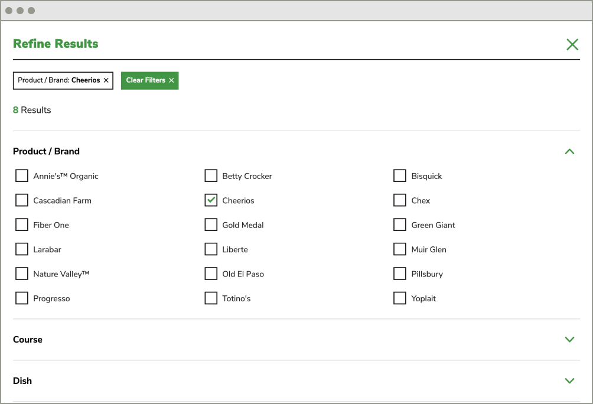
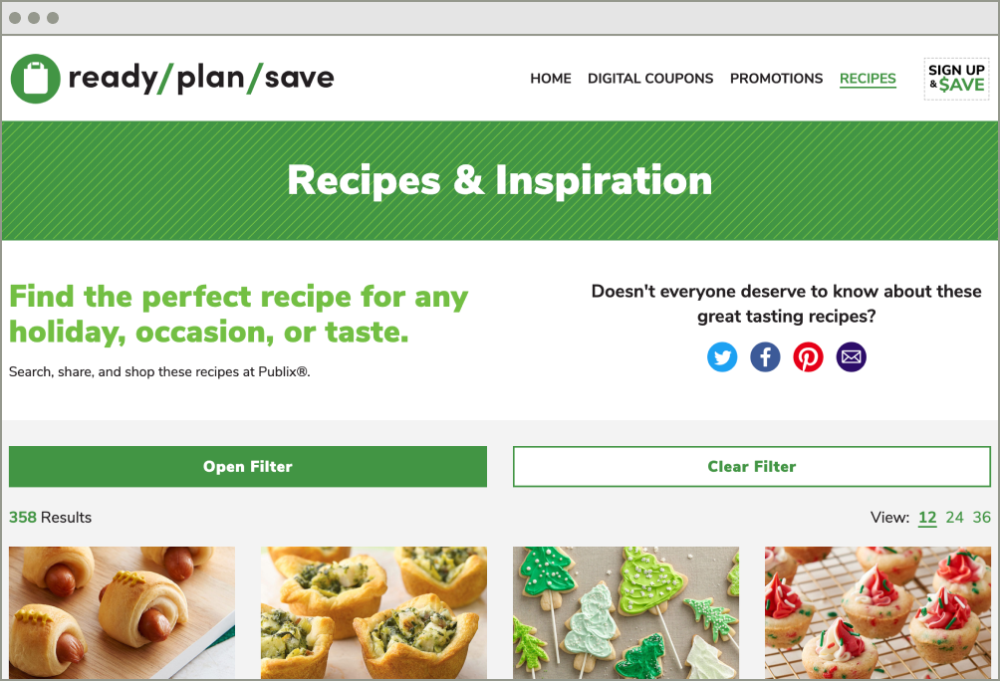

I've used the WordPress API in many different ways, but on the Ready Plan Save project I found a completely new way to leverage it. This project came to our team because the client desperately needed a design refresh along with better functionality for the frequent promotions they run. Most of that seemed straight forward, but the part that seemed daunting was migrating over the large amount of recipes being stored as a custom post type currently. Normally this wouldn't be too challenging, but I wanted to improve the architecture of their recipe data to better support rich search results with structured data.

To solve my migration problem, I came up with a solution using the built-in WordPress REST API. The solution involved writing a custom plugin that could pull (GET) from the previous site's API routes and push (POST) to the new site's API routes. Of course I had to do a little massaging of the data in the middle, but that part was kind of enjoyable. The most enjoyable part I found was using Cloudinary to do some image resizing and optimization before I sideloaded the images into the new media library. I was impressed with how easily you could leverage Cloudinary to perform image optimizations that would either be tedious to do manually or involved quite a bit of scripting to do correctly.

In the end, the Ready Plan Save project was a great success and I was happy to have learned another great way to leverage the WordPress REST API. We'll see what I come up with next.

